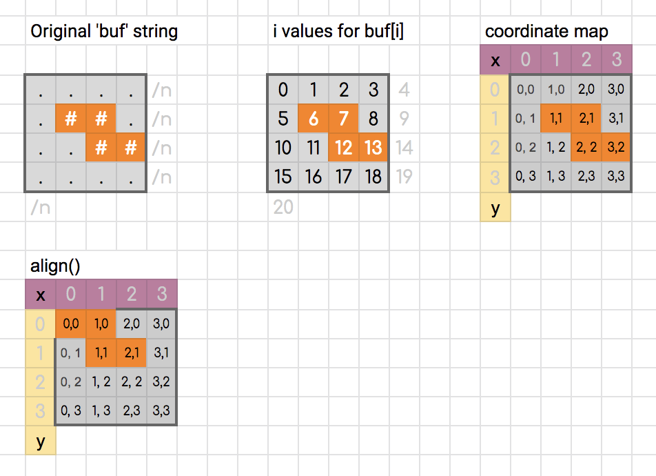
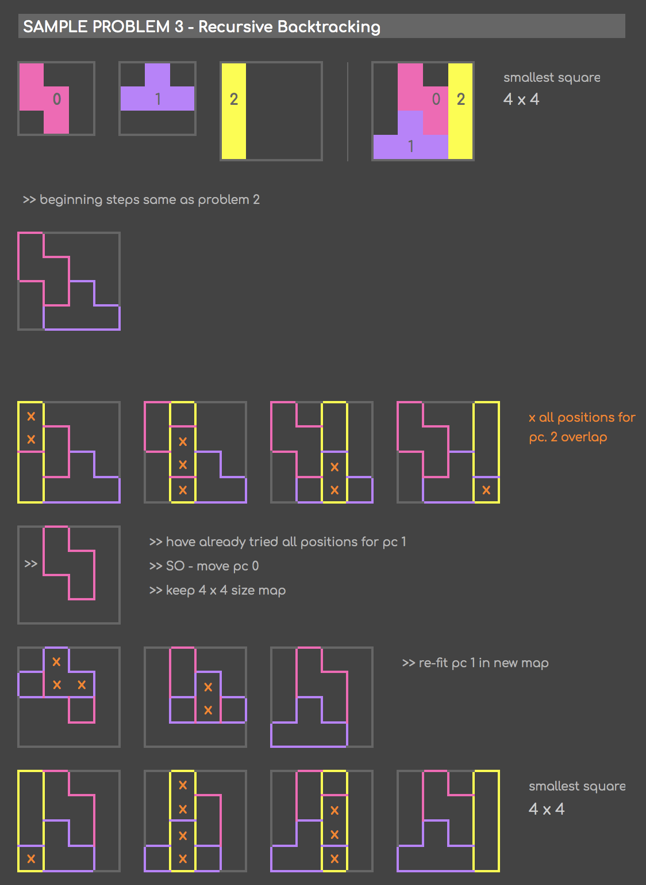
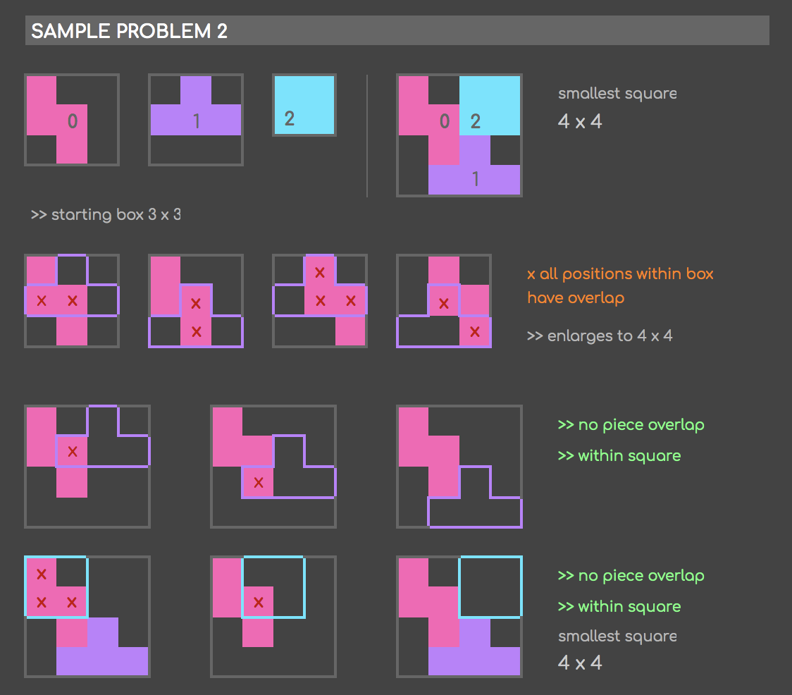

# Hive-Fillit

**Algorithms Practice - Fit tetris pieces into the smallest square possible.**

`Score: 100/100 (Outstanding Project x 3)`

# What Fillit Does:
Fillit recieves a map text file like this one with pieces.

  

 
It finds the smallest possible square the pieces can be arranged in and prints out the square like this:
 

  

# How does it work?
Our functions are also commented in our Project Files.

This project relies on the [standard C Libary functions that we had to recode for our first project.](https://github.com/lsjoberg98/Libft)

First the file is read by the parser and all the pieces are checked to make sure they are valid. These are the only valid pieces. 

* Checks for any invalid characters
* Checks for wrong-length lines ('\n' in an invalid position)
* Counts number of '#' characters (Must be 4)
* Checks for '\n' at end of piece block
* Checks each '#' character to see if it's adjacent to another - A valid piece with 4 '#' characters will either have 6 or 8 adjacencies.

  
  

 
The solver works using recursive backtracking. If the piece doesn't overlap any other pieces it places it on the map and then tries to call solve_map on all of the other pieces. If they all fit with the current piece in place then it succeeds. If not it moves the current piece and tries to solve the rest of the pieces with the current piece in it's new place. If it's moved all the pieces and still can't make them fit on the current map then it exits the solver, makes a larger map, and then tries to solve again.

  
  

 

  
  

# Speed Requirements
This is not on the PDF but is a requirement by the grading scale.

`time ./fillit test1.prm`

    must execute <= 1 second

`time ./fillit test7.prm`

    30 seconds+ -> 0 pts
    20-30 seconds -> 1 pt
    10-20 seconds -> 2 pt
    5-10 seconds -> 3pt
    1-5 seconds -> 4pt
    < 1 second -> 5 pt

Ours scores 0.00s in both cases so we got max score on this part.

# Team

[Olli](https://github.com/osamooja)
